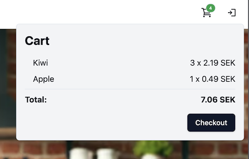

# Lab 11: Creating an Orleans-based Shopping Cart

Since it is a e-commerce website, you obviously need to create a shopping cart solution for it. But instead of just creating one using cookies or a database, the powers to be have decided that using Project Orleans would be a better fit.

Using Project Orleans might be a bit overkill for a shoppingcart... But, it does offer some interesting potential for future enhancements.

## Steps (for Visual Studio)

###  Create the Grain

The first step in any Project Orleans project, is to reference the correct NuGet package. 
In this case, you are going to put all of the Orleans code in the same project, the __WebDevWorkshop.Web__ project. So, go ahead and open the __WebDevWorkshop.Web__ and add a reference to the __Microsoft.Orleans.Server__ NuGet package.

This gives us access to all the classes we need to create `Grain` classes, as well as host silos.

The next step is to create the grain needed to represent a shopping cart. However, to keep some form of structure in the project, let's put the shopping cart specific code in a separate directory.

Create a directory called __ShoppingCart__, and then a new class called __ShoppingCartGrain__ inside it. 

Before you can start implementing the actual grain, you will need an interface to represent a shopping cart. And because the grain might be called over the network, all methods need to be asynchronuous.

Because it is such a simple grain, you might as well keep both the interface and class in the same file. So, add a new interface called __IShoppingCart__ at the top of the __ShoppingCartGrain.cs__ file. The interface needs to implement `IGrainWithStringKey` to make it a "grain interface". 

__Note:__ In this case the grain will be identified using a string, thus you use the `IGrainWithStringKey` interface. But there are also `IGrainWithIntKey`, `IGrainWithGuidKey` and as well as versions for compound keys if your key isn't a string.

```csharp
public interface IShoppingCart : IGrainWithStringKey
{   
}
```

The "problem" now, is that you need a "thing" to represent a shopping cart item, so that you can pass items to and from the grain. In this case, the "thing" is a `ShoppingCartItem`, which you can represent using a very simple DTO.

Add a class right after the `IShoppingCart` interface. It should look like this

```csharp
public class ShoppingCartItem
{
    public int ProductId { get; set; }
    public string ProductName { get; set; } = string.Empty;
    public decimal Price { get; set; }
    public int Count { get; set; }
}
```

This is all you need to represent an item in the shopping cart.

Now, that you have a DTO to represent the item, you need to tell Orleans how to serialize it when gooing across the network.

Normally, you would just add a `SerializableAttribute` to the class. However, Orleans uses protobuff serialization. And because of this you need to do something a little different... So, instead of adding a `SerializableAttribute`, you need to add a `GenerateSerializerAttribute` to the class, and a `IdAttribute` to each property to tell it the order in which the properties should be serialized. Like this

```csharp
[GenerateSerializer]
public class ShoppingCartItem 
{
    [Id(1)] public int ProductId { get; set; }
    [Id(2)] public string ProductName { get; set; }
    [Id(3)] public decimal Price { get; set; }
    [Id(4)] public int Count { get; set; }
}
```

__Note:__ There is actually a code generator that can help you set the `IdAttribute`. You just need to add the `[GenerateSerializer]` part. Then put the cursor on that line and press __Ctrl + .__ and choose "Generate serializer attributes"

Now that the DTO is available, you can go back and focus on the `IShoppingCartGrain` interface. It only really needs 2 methods, one to add an item and one to get all items.

```csharp
public interface IShoppingCart : IGrainWithStringKey 
{ 
    Task AddItem(ShoppingCartItem item);
    Task<ShoppingCartItem[]> GetItems();
}
```

The next step is to have the `ShoppingCartGrain` implement the `IShoppingCartGrain`. However, it also needs to inherit from `Grain` to make it a grain.

```csharp
public class ShoppingCartGrain : Grain, IShoppingCart
{
    public Task AddItem(ShoppingCartItem item)
    {
    }

    public Task<ShoppingCartItem[]> GetItems()
    {
    }
}
```

Ok, with that in place, you can start focusing on the implementation. Which, because of the way that Orleans work, is actually very simple...

First of all, you need a way to store the shopping cart items. And the easiest way to do that, is simply a `List<ShoppingCartItem>`

```csharp
public class ShoppingCartGrain : Grain, IShoppingCart
{
    private readonly List<ShoppingCartItem> items = new();
    ...
}
```

Now, to implement the `AddItem()` method, you first need to verify if the cart already contains an item of the same type. Do this by checking to see if the `items` list contains any item with the same product id

```csharp
public Task AddItem(ShoppingCartItem item)
{
    var existingItem = items.FirstOrDefault(x => x.ProductId == item.ProductId);
}
```

If it doesn't, all you need to do, is to add it to the list

```csharp
public Task AddItem(ShoppingCartItem item)
{
    var existingItem = items.FirstOrDefault(x => x.ProductId == item.ProductId);
    if (existingItem is null)
    {
        items.Add(item);
    }
}
```

On the other hand, if there is already one in the list, you can just update the count

```csharp
public Task AddItem(ShoppingCartItem item)
{
    ...
    else
    {
        existingItem.Count += item.Count;
    }
}
```

And because it needs to be asynchronuous, you need to return a `Task` at the end

```csharp
public Task AddItem(ShoppingCartItem item)
{
    ...
    return Task.CompletedTask;
}
```

That's it!

Implementing the `GetItems()` method is even easier. All you need to do is return the items as an array...

```csharp
public Task<ShoppingCartItem[]> GetItems()
    => Task.FromResult(items.ToArray());
```

That concludes the work needed on the shopping cart grain.

### Setting up a Silo to host the grains

Once you have your grains in place, you need a way to store them. And that is done by adding one or more silos.

In this case, when running locally on a single machine, you will only have a single silo. But the usage is exactly the same whether or not you have one or a thousand silos. It is just a matter of how many silos you spin up. Orleans handles the rest.

Silos can be added to any application hat has an `IHost` interface. In your case, the `WebApplication` implements `IHost`. So, you can simply add a silo to the __WebDevWorkshop.Web__ application. 

Open __Program.cs__ in the __WebDevWorkshop.Web__ project and add a call to `builder.Services.AddOrleans()` right before your "build" the application. The method takes a `Task<ISiloBuilder>` as a parameter

```csharp
...
builder.Services.AddControllers();

builder.Services.AddOrleans(silo => {

})

var app = builder.Build();
...
```

The `ISiloBuilder` interfabe lets you to tell Orleans what kind of cluster set up you want. In this case, as you are only running on your local machine, "local host clustering" would be the best option. So, go ahead and call `UseLocalhostClustering()` to tell Orleans that you want a single node cluster running on your local machine

```csharp
builder.Services.AddOrleans(silo => { 
    silo.UseLocalhostClustering();
});
```

### Add endpoints for the front-end to use

Now that you have a Orleans "cluster" up and running, you need to give the front-end a way to talk to it. The easiest way to do this, and the way that the UI project expects, is to add a couple of HTTP endpoints. One to add an item, and one te get the added items.

As these are fairly simple endpoints, you might as well implement them using minimal APIs.

__Note:__ As you are already using MVC, that might be a better option in a real-world scenario. But for this lab, it might be unteresting to play around with minimal APIs as well...

Start by adding a POST endpoint right after the `MapControllers()` step in the request pipeline. The path should be __/api/shipping-cart__

```csharp
...
app.MapControllers();

app.MapPost("/api/shopping-cart", async ctx => {

});
...
```

Once again you need a DTO to represent the data that should be passed to the API. In this case, you need a product id and a count.

Now, once again, to keep a bit of structure, and follow conventions, you should put that in a separate directory. So, create a __Models__ directory, and add a new, public `record` called __AddShoppingCartItemModel__ inside it. 

The __AddShoppingCartItemModel__ should have 2 `ìnt` properties called __ProductId__ and __Count__

```csharp
public record AddShoppingCartItemModel(int ProductId, int Count);
```

Then go back to the POST endpoint you just created, and add it as a parameter to the request delegate.

__Note:__ As you add another parameter to the request delegate, you also need to type the `ctx` parameter as `HttpContext`

```csharp
app.MapPost("/api/shopping-cart", 
            async (AddShoppingCartItemModel model, HttpContext ctx) => {

            });
```

Now, as you only get a product id, you need a way to verify if that product exists, as well as retrieve the name of it. And for this, you need the `IProductsClient` as well

```csharp
app.MapPost("/api/shopping-cart", 
            async (AddShoppingCartItemModel model, 
            HttpContext ctx, 
            IProductsClient productsClient) => {

            });
```

Now that you have the signature needed, it is time to start implementing the endpoint.

The first step is to ask the `IProductsClient` for the product with the provided product id. And if that can't be found, you should return 400 Bad Request

```csharp
var product = await productsClient.GetProduct(model.ProductId);
if (product is null)
{
    return Results.BadRequest();
}
```

If the product exists, you need to get hold of the user's shopping cart. And to do that, you need a way to uniquely identify the user. However, as the user isn't authenticated, you won't know who they are... The easiest way to solve this, is by adding a cookie to track the user.

So, start by checking to see if the user has a cookie called __ShoppingCartId__. If they do, let's use that.

```csharp
string cartId;
if (ctx.Request.Cookies.ContainsKey("ShoppingCartId")) 
{
    cartId = ctx.Request.Cookies["ShoppingCartId"]!;
}
```

But what do you do if the user doesn't have a cookie? Well, then the user hasn't create a shopping cart yet, so you need to create a unique id for them.

You could simply use a `Guid` to get a unique string. However, as this workshop is about trying new things, let's try something a little different. Let's build a unique string using the following code instead

```csharp
else 
{ 
    var rnd = new Random();
    cartId = new string(Enumerable.Range(0, 30)
        .Select(x => (char)rnd.Next('A', 'Z'))
        .ToArray());
}
```

This code will generate a 30 character, unique string containing only uppercase letters between A and Z.

After creating the identifier, you also need to add it to a cookie for future use

```csharp
else 
{ 
    ...
    ctx.Response.Cookies.Append("ShoppingCartId", cartId);
}
```

Ok, now you have a unique identifier for the user. Using that, you can go ahead and get, or create, the users shopping cart grain. However, to get hold of a grain, you need the `IGrainFactory` service. So, go ahead and add that to the request delegate as well

```csharp
app.MapPost("/api/shopping-cart", 
            async (...
            IGrainFactory grainFactory) => {
                ...
            });
```

Using the `IGrainFactory`, you can go ahead and get a proxy to the grain you want using the `GetGrain<T>(string key)` method. In this case, the `T` is your `IShoppingCart`, and the key is the users unique identifier

```csharp
app.MapPost("/api/shopping-cart", 
            async (...) => {
                ...
                else 
                { 
                    ...
                }
                var cart = grainFactory.GetGrain<IShoppingCart>(cartId);
            });
```

__Note:__ There are some security implications when using a simple string like this, as it is only "security by obscurity". However, it is hard to do something more secure in an unauthenticated situation. And also, worst case is that someone can see someone elses shopping cart if they can guess another users 30 character string

Once you have access to the grain, you can simply go ahead and call the `AddItem()` method

```csharp
var cart = grainFactory.GetGrain<IShoppingCart>(cartId);
await cart.AddItem(new ShoppingCartItem
{
    ProductId = product.Id,
    ProductName = product.Name,
    Price = product.Price,
    Count = model.Count
});
```

The front-end expects this call to return HTTP 200, as well as the current list of shopping cart items. So, the last step in this method is to use the cart to get the items, and return them wrapped in an OK

```csharp
return Results.Ok(await cart.GetItems());
```

That's what you need to do to add things to the cart. Getting the contents is of course a lot simpler.

Go ahead and create a new GET endpoint right after the POST endpoint you just created. The path should be __/api/shopping-cart__.

```csharp
app.MapGet("/api/shopping-cart", async ctx => {

});
```

Once again, you will need the grain factory to get hold of the user's shopping cart grain. So, go ahead and add that as a parameter to the callback. 

```csharp
app.MapGet("/api/shopping-cart", 
            async (HttpContext ctx, 
            IGrainFactory grainFactory) => {

            });
```

Now, the first thing you need to do in here, is to see if the user has a shopping cart cookie. 

```csharp
app.MapGet("/api/shopping-cart", 
            async (HttpContext ctx, 
            IGrainFactory grainFactory) => {
                if (ctx.Request.Cookies.ContainsKey("ShoppingCartId"))
                {
                }
            });
```

If they do, then you can use the value in that cookie to get the user's shopping cart grain. And then return the items in it, wrapped in an OK

```csharp
if (ctx.Request.Cookies.ContainsKey("ShoppingCartId"))
{
    var cart = grainFactory.GetGrain<IShoppingCart>(
        ctx.Request.Cookies["ShoppingCartId"]
    );
    return Results.Ok(await cart.GetItems());
}
```

If the user doesn't have a cookie, then they haven't added anything to the cart either. So you can just return an empty array

```csharp
if (ctx.Request.Cookies.ContainsKey("ShoppingCartId"))
{
    ...
}
return Results.Ok(Array.Empty<ShoppingCartItem>());
```

### Verify that the shopping cart works

Now that you have implemented the required grain, added silo to hold the grain, and created end required endpoints, it is time to see if it works.

Press __F5__ and try adding items to the shopping cart. After the first item has been added to the cart, you should see a shopping cart icon in the top right corner of the site. You should also be able to click to see what is in the cart



__Note:__ The shopping cart is a bit limited as it does not support removal etc. But, it shows the concept of how to use Orleans for the functionaluty. And that's the goal. Not a fully working shopping cart...

[<< Lab 10](../lab10/lab10.md) | [Lab 12 >>](../lab12/lab12.md)