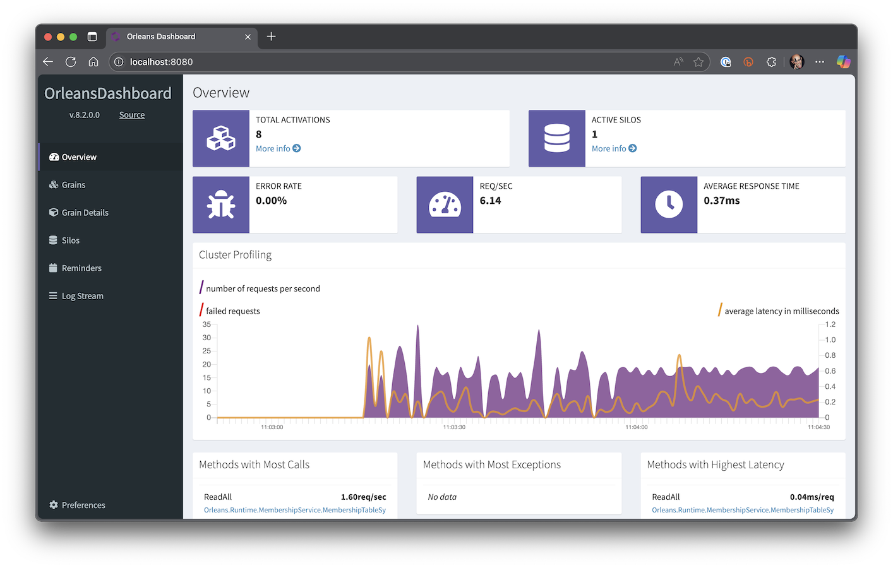

# Lab 12: Persisting the Shopping Cart

Currently the shopping carts have no real persistence. It is all in-memory. So, if you were to restart the application, or Orleans decided to garbage collect some of the grains, the data would be gone.

However, Orleans do come with support for persistence. So, that is what this lab is about.

## Steps (for Visual Studio)

###  Adding memory storage

To keep it simple, this lab will just use a memory persistence store. This allows Orleans to store state in-memory, which is better than no state at all, as it means that grains that are garbage collected can be "re-hydrated". But it doesn't solve the long term persistence needed in most systems.

__Note:__ There are also ways to do custom persistence, where you decide how to persist the state. And it is actually not that hard to do. More information about that can be found [here](https://learn.microsoft.com/en-us/dotnet/orleans/grains/grain-persistence)

The first step in adding memory persistence is to add a the NuGet package called __Microsoft.Orleans.Persistence.Memory__ to the __WebDevWorkshop.Web__ project. This allows you to add persistence to Orleans grains by simply calling `AddMemoryGrainStorageAsDefault()` on the `ISiloBuilder` in the __Program.cs__ file in that same project.

```csharp
builder.Services.AddOrleans(silo =>
{
    silo.UseLocalhostClustering();
    silo.AddMemoryGrainStorageAsDefault();
});
```

The next step is to update the grain to use it. And the way that state is handled, is by injecting a "state" object in the grain. 

To support that, you need to create a class to represent the state you want to use in the grain. In this case, it is fairly simple. You need to the `List<ShoppingCartItem>` instance. 

Create a new class called __ShoppingCartState__ inside the `ShoppingCartGrain` class

```csharp
public class ShoppingCartGrain : Grain, IShoppingCart
{
    ...
    public class ShoppingCartState
    {
        
    }
}
```

It needs a single property of type `List<ShoppingCartItem>`, called __Items__

```csharp
public class ShoppingCartState
{
    public List<ShoppingCartItem> Items { get; set; } = new();
}
```

Now that you hava a "state object", you need to update the grain to use it. 

The way that Orleans injects state, is that it injects an instance of `IPersistentState<T>`, where `T` is the type of the "state object" to use. In your case `ShoppingCartState`. Like this

```csharp
public class ShoppingCartGrain : Grain, IShoppingCart
{
    private readonly List<ShoppingCartItem> items = new();
    private readonly IPersistentState<ShoppingCartState> _state;

    public ShoppingCartGrain(IPersistentState<ShoppingCartState> state)
    {
        _state = state;
    }
    ...
}
```

Unfortunately this isn't enough. You also need to mark the `state` parameter with a `PersistentStateAttribute`, which takes a "state name" parameter that can be used by the persistence mechanism to store it in different tables for example. In this case, it has no real impact, so you might as well just pass in something like __ShoppingCartState__

```csharp
public ShoppingCartGrain(
    [PersistentState("ShoppingCartState")] 
    IPersistentState<ShoppingCartState> state
)
{
    _state = state;
}
```

Ok, so now that you have access to the state like this, you don't need the `items` member anymore. So, you can simply remove it, and update all the places that used it to use `_state.State.Items`

```csharp
public class ShoppingCartGrain : Grain, IShoppingCart
{
    private readonly IPersistentState<ShoppingCartState> _state;

    ...

    public Task AddItem(ShoppingCartItem item)
    {
        ... = _state.State.Items.FirstOrDefault(x => x.ProductId == item.ProductId);
        if (...)
        {
            _state.State.Items.Add(item);
        }
        ...
    }
    
    public Task<ShoppingCartItem[]> GetItems()
        => Task.FromResult(_state.State.Items.ToArray());

    ...
}
```

You also need to make sure to save the state whenever items are added. This is done using the `WriteStateAsync()` method that the `IPersistentState<T>` provides. So, instead of returning `Task.CompletedTask` at the end of the `AddItem()` method, you should return the `Task` returned from `_state.WriteStateAsync()`

```csharp
public Task AddItem(ShoppingCartItem item)
{
    ...
    return _state.WriteStateAsync();
}
```

__Note:__ Under the hood, the `WriteStateAsync()` will use the grain store to persist it, which is where you are able to "plug in" your own persistence as well


### Verify persistence works

It is actually really hard to verify that the memory persistence works, and there is no way to look at the memory. And since it only really makes a difference when garbage collection happens, it is even harder.

However, you are more than welcome to inject a `Logger<T>` in your grains and add some logging statements in the constructor. These can then be viewed in the Aspire Dashboard.

You might also be able to set a break point in the constructor of the `ShoppingCartGrain` to see the state being injected. Even if it will be injected as empy in most cases...

### Adding the Orleans Dashboard

Another way to see what is happening in the Orleans part of the system, is to add the Orleans Dashboard.

All you need to do to get that working, is to add the NuGet package __OrleansDashboard__ to the __WebDevWorkshop.Web__ project, and then call `UseDashboard();` on the `ISiloBuilder` in __Program.cs__

```csharp
builder.Services.AddOrleans(silo =>
{
    ...
    silo.UseDashboard();
});
```

With that in place, you can press __F5__ to start debugging. 

You can't see it in the Aspire Dashboard, but there is now another Dashboard available at http://localhost:8080. So try browsing to that.



In this dashboard, you can see the different grains and silos etc in your cluster. This can be a very useful tool when trying to figure out what is happening in Orleans.

### Fixing the hard-coded port number

Having the Orleans Dashboard hardcoded to 8080 is not the greatest solution. Aspire does a lot of work to make sure ports don't collide. 

Instead of hard-coding the port, let's let Aspire create on for you. To do that, you need to use the `WithHttpEndpoint`. This method tells Aspire to add another port for you. And the port number can be injected to your application as an envrinoment variable by using the `env` parameter to tell it what environment variable name to use

Open the __AppHost.cs__ file in the __WebDevWorkshop.AppHost__ project, and add the a call to `WithHttpEndpoint()` that looks like this

```csharp
builder.AddProject<Projects.WebDevWorkshop_Web>("webdevworkshop-web", "aspire")
    .WithExternalHttpEndpoints()
    .WithHttpEndpoint(env: "DashboardPort")
    ...
```

This will inject the provided port number using the environment variable called __DashboardPort__. Using that variable, you can now tell the Orleans Dashboard to listen to that port instead of the default 8080.

Maybe it is a good idea to only add the Dashboard if that variable is provided, so you don't end up using port 8080 by mistake.

Open the __Program.cs__ file in the __WebDevWorkshop.Web__ project. Then update the adding of the Orleans Dashboard so that it only adds it if the __DashboardPort__ environment variable exists. And then of course uses that port instead of the default one

```csharp
builder.Services.AddOrleans(silo =>
{
    ...
    if (Environment.GetEnvironmentVariable("DashboardPort") is not null)
    { 
        silo.UseDashboard(options => {
            options.Port = int.Parse(Environment.GetEnvironmentVariable("DashboardPort")!);
        });
    }
});
```

### Optional: Add a link to the Dashboard in Aspire

If you want to make it easier to access the Orleans dashboard, you can go ahead and add a link to the Aspire Dashboard.

Just open the __AppHost.cs__ file in the __WebDevWorkshop.AppHost__ project, and locate the code that adds the __WebDevWorkshop.Web__ project resource. 

As part of registering the resource, you can use the `WithUrlForEndpoint()` extension method to modify the URL that is used for this endpoint in the Dashboard.

However, to modify the endpoint we added for the Orleans Dashboard, you need to first give it a name

```csharp
builder.AddProject<Projects.WebDevWorkshop_Web>(...)
    .WithExternalHttpEndpoints()
    .WithHttpEndpoint(name: "OrleansDashboard", env: "DashboardPort")
    ...
```

Once it has a name, you can call the `WithUrlForEndpoint()` method

```csharp
builder.AddProject<Projects.WebDevWorkshop_Web>(...)
    .WithExternalHttpEndpoints()
    .WithHttpEndpoint(name: "OrleansDashboard", env: "DashboardPort")
    .WithUrlForEndpoint("OrleansDashboard", url => {
        
    })
    ...
```

There are quite a few things you can do to modify the URL to your liking. In this case, all you want to do, is to set the `DisplayText` property to __Orleans Dashboard__

```csharp
.WithUrlForEndpoint("OrleansDashboard", url => {
    url.DisplayText =  "Orleans Dashboard";
})
```

If you press __F5__ now, to start Aspire, you should now see a new link called __Orleans Dashboard__ on the __webdevworkshop-web__ resource. And if you click on it, you should end up on the Orleans Dashboard as expected.

__Note:__ Depending on the screen size and resolution, you might have to click on the little "pill" that says __+1__ to see the link.

[<< Lab 11](../lab11/lab11.md) | [Lab 13 >>](../lab13/lab13.md)