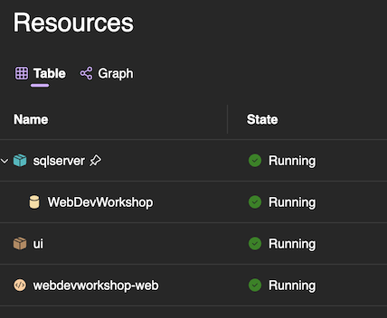

# Lab 3 - Adding a SQL Server database

The UI expects a couple of REST-ful endpoints to retrieve the product information to display in the application. However, before we can start implementing these, we need to have a database to store the data in.

## Steps (for Visual Studio)

### Add the required NuGet packages

In the __WebDevWorkshop.AppHost__ project, add a reference to the `Aspire.Hosting.SqlServer` NuGet package.

### Add the SQL Server

Open the __AppHost.cs__ file in the __WebDevWorkshop.AppHost__ project, and at the top, right after the creation of the `builder` instance, add a call to `AddSqlServer()` to add a SQL Server to your AppModel.

```csharp
var db = builder.AddSqlServer("sqlserver");
```

This will make sure that a SQL Server container is set up when you run the project. However, as containers a ephemeral, it is recomended to add a data volume to store the data. So, go ahead and call the `WithDataVolume()` extension method to add a data volume

```csharp
builder.AddSqlServer("sqlserver")
        .WithDataVolume("webdevworkshopdata");
```

As starting the SQL Server container is a bit on the slow side, it is a good idea to leave it running once it has been started. This con be configured by calling the `WithLifetime()` method, passing in `ContainerLifetime.Persistent`. 

```csharp
builder.AddSqlServer("sqlserver")
        ...
        .WithLifetime(ContainerLifetime.Persistent);
```

__Note:__ You are now responsible for stopping the container when you are done developing with it.

### Adding a database

Now that you have a SQL Server instance, you also need a database in it. This is easily added by calling the `AddDatabase()` method, passing in the required name of the database. 

```csharp
builder.AddSqlServer("sqlserver")
    ...
    .AddDatabase("WebDevWorkshop");
```

As you will need to reference this database in the project hosting the __WebDevWorkshop.Web__ project, you will need to store the returned `IResourceBuilder<SqlServerDatabaseResource>` in a variable

```csharp
var db = builder.AddSqlServer("sqlserver")
         ...
```

### Verify that it works

With that code in place, you can press __F5__ to start debugging.

You should now see a SQL Server and a SQL Server Database resource in the Aspire Dashboard.



__Note:__ It might take a while for them to start up, as it needs to download the SQL Server Docker image to your machine if it is not already there. 

[<< Lab 2](./lab2.md) | [Lab 4 >>](./lab4.md)