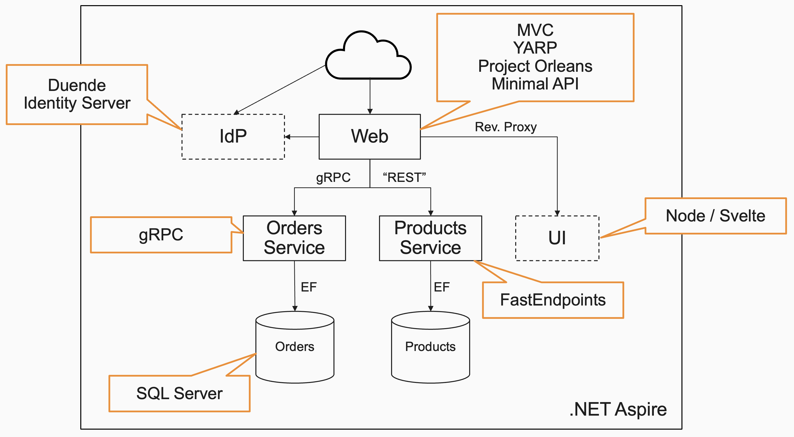

# Web Dev Workshop

This repo contains the instructions for running a 2-day web development workshop.

## The goal

The end goal during this workshop is to build a solution that looks like the following

## Workshop outline

The 2 days include a combination of presentations and labs, and breaks of course. The general outline is as follows

### Day 1

- Intro to the solution and what we are building
- Presentation: Getting started with Aspire
- [Lab 1: Setting up Aspire](./labs/lab1/lab1.md) - (20 min)
- Presentation: What is YARP (Yet Another Reverse Proxy)
- [Lab 2: Setting up YARP](./labs/lab2/lab2.md) - (10 min)
- [Lab 3: Adding a SQL Server database](./labs/lab3/lab3.md) - (10 min)
- [Lab 4: Creating a Products Service](./labs/lab4/lab4.md) - (30 min)
- Presentation: FastEndpoints - Another API endpoint option
- [Lab 5: Implementing the Products API using FastEndpoints](./labs/lab5/lab5.md) - (30 min)
- Presentation: Testing APIs
- [Lab 6: Integration Testing the Products API](./labs/lab6/lab6.md) - (1 hour 30 min)
- [Lab 7: Clean up the Integration Testing](./labs/lab7/lab7.md) - (20 min)
- [Lab 8: Testing the Product Endpoint](./labs/lab8/lab8.md) - (10 min)
- Presentation: The benefits of SDK:s over APIs
- [Lab 9: Creating an SDK for the Products API](./labs/lab9/lab9.md) - (20 min)
- [Lab 10: Providing the UI with Products](./labs/lab10/lab10.md) - (30 min)

### Day 2
- Recap and goal for the day
- Presentation: Project Orleans - The very quick primer
- [Lab 11: Creating an Orleans-based Shopping Cart](./labs/lab11/lab11.md) - (50 min)
- [Lab 12: Persisting the Shopping Cart](./labs/lab12/lab12.md) - (50 min)
- Optional: [Lab 13: Testing the Shopping Cart Endpoints](./labs/lab13/lab13.md) - (1 hour)
- Presentation: ASP.NET Core Authentication
- [Lab 14: Adding a IdentityServer](./labs/lab14/lab14.md) - (45 min)
- [Lab 15: Adding User Authentication](./labs/lab15/lab15.md) - (30 min)
- [Lab 16: Testing with Authentication](./labs/lab16/lab16.md) - (45 min)
- [Lab 17: Creating a gRPC-based Orders Service](./labs/lab17/lab17.md) - (45 min)
- [Lab 18: Testing gRPC Services](./labs/lab18/lab18.md)
- [Lab 19: Consuming gRPC Services](./labs/lab19/lab19.md)
- Presentation: Introduction to OpenTelemetry
- [Lab 20: Adding Custom Data to the OTEL Traces](./labs/lab20/lab20.md)
- Optional: Presentation: The Outbox Pattern and EF Core Interceptors
- Optional [Lab 21: Outbox Pattern using EF Core Interceptors](./labs/lab21/lab21.md)
- Optional: [Lab 22: Deploying using Docker Compose](./labs/lab21/lab21.md)

## Source Code

Well, you are already in the repo that contains everything you need. And it does include completed solutions in each one of the lab directories. So, in the the [Lab 22 - completed directory](./labs/lab22/completed), you can find a complete solution.

__Note:__ You will not be able to just run any off the solutions from lab 14 and onwards as they require you to set up a certificate. The documentation for how to do that is in [Lab 14](./labs/lab14/lab14.md).

If you struggle with getting a lab completed, you can always clone this repo and get the completed source for that lab. Each lab directory (/labs/labXX) has a sub directory called __complete__ that contains the code as it should look after it has been completed.

## Questions?

If you are in the workshop, just let Chris know that you have a question. If you are not currently attending the workshop, you can contact Chris on Twitter, where his handle is [@ZeroKoll](https://twitter.com/ZeroKoll), or through mail at chris(a)59north.com.